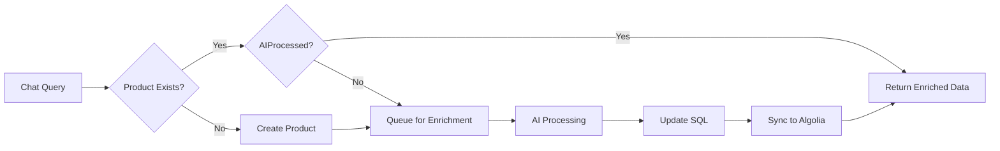

# 🤖 Rules Engine & AI Enrichment Module

> AI-powered product enrichment, classification, and auto-approval system for QuickITQuote (qiq-chat)

## 📋 Overview

The Rules Engine is a standalone service module within the qiq-chat project that provides intelligent product enrichment and classification capabilities using AI (OpenAI GPT or Google Gemini). It analyzes IT products and:

### Core Capabilities

**Product Enrichment:**
- Generates short and long product descriptions
- Creates feature lists and specification tables
- Develops FAQs and prerequisites
- Suggests professional services scope
- Provides upsell and bundle recommendations
- Creates marketing value propositions

**Classification & Rules:**
- Product category and subcategory classification
- Classification type (Standard, Custom, Special Order)
- Auto-approval eligibility based on rules
- Lead time estimates
- Product and category-level rules

**Image Management:**
- Searches for product images using Google Custom Search
- Analyzes background color (prefers ≥78% white background)
- Fallback to manufacturer default images

**Search Integration:**
- Syncs enriched data to Algolia for optimized search
- Maintains read-only mirror of QuoteWerks data
- Supports faceted search and filtering

## 🏗️ Architecture

```
rules-engine/
├── README.md                    # This file
├── .env.example                 # Environment variables template
├── mapping-reference.md         # Field mapping documentation
├── copilot-instructions.md      # AI generation instructions
├── rules-engine.js              # Main enrichment entry point
├── algolia-sync.js              # Algolia synchronization script
├── schema.sql                   # Product enrichment schema
│
├── config/
│   └── dbConfig.json            # Database configuration
│
├── db/
│   └── schema.sql               # Original classification schema
│
├── src/                         # Classification module (original)
│   ├── index.js                 # Classification entry point
│   ├── aiService.js             # AI integration (OpenAI/Gemini)
│   ├── dbService.js             # Database operations
│   ├── rulesEngine.js           # Core rules processing
│   ├── autoApproval.js          # Auto-approval logic
│   └── logger.js                # Logging utility
│
├── utils/                       # Enrichment utilities (new)
│   ├── ai-helper.js             # OpenAI enrichment helpers
│   ├── google-helper.js         # Google image search helpers
│   └── sql-helper.js            # SQL connection and updates
│
├── logs/
│   ├── rules-engine.log         # Enrichment logs
│   └── sync.log                 # Algolia sync logs
│
└── package.json
```

## 🔄 Enrichment Workflow

### Product Enrichment Process

1. **Detection**: Identifies unprocessed products (AIProcessed = 0)
2. **AI Enrichment**: Generates comprehensive product data using OpenAI
3. **Image Search**: Finds suitable product images via Google Custom Search
4. **Database Update**: Stores enriched data in QuoteWerks Products table
5. **Logging**: Records processing details and confidence scores
6. **Algolia Sync**: Mirrors enriched data to Algolia search index

### Integration Flow



## 🚀 Quick Start

### Prerequisites

1. **Node.js** version 18 or higher
2. **SQL Server** database (QuoteWerksDB or similar)
3. **API Keys** (at least one):
   - OpenAI API key, or
   - Google Gemini API key

### Installation

```bash
# Navigate to the rules-engine directory
cd qiq-chat/rules-engine

# Install dependencies
npm install
```

### Configuration

#### 1. Database Setup

Edit `config/dbConfig.json` with your SQL Server credentials:

```json
{
  "user": "your_username",
  "password": "your_password",
  "server": "localhost",
  "database": "QuoteWerksDB",
  "options": {
    "encrypt": false,
    "trustServerCertificate": true
  }
}
```

Then run the schema script to create required tables:

```sql
-- Connect to your SQL Server and run:
USE QuoteWerksDB;
GO

-- Execute the schema.sql file
-- This creates: AI_Log, Rules_Item, Rules_Category tables
```

#### 2. Environment Variables

Create or update `.env` file in the **root qiq-chat directory** (not in rules-engine):

```bash
# OpenAI Configuration (optional)
OPENAI_API_KEY=sk-xxxxxxxxxxxxxxxxxxxx
OPENAI_MODEL=gpt-4o-mini

# Google Gemini Configuration (optional)
GOOGLE_API_KEY=xxxxxxxxxxxxxxxxxxxx
GEMINI_MODEL=gemini-1.5-flash

# Google Search (optional, for enhanced product research)
GOOGLE_CX_ID=xxxxxxxxxxxxxxxxxxxx
```

**Note**: The Rules Engine uses `dotenv` to read from the parent directory's `.env` file automatically.

### Usage

#### Product Enrichment (New)

Process unprocessed products for AI enrichment:

```bash
# Process 20 products (default)
node rules-engine.js

# Process custom number
node rules-engine.js 50    # Process 50 products
```

#### Algolia Sync

Sync enriched products to Algolia:

```bash
# Sync all processed products
node algolia-sync.js

# Configure Algolia index settings first time
node algolia-sync.js --configure
```

#### Classification Only (Original)

Run classification without enrichment:

```bash
# Process with sample data
npm start

# Process custom number
node src/index.js 10    # Process 10 sample products
node src/index.js 50    # Process 50 sample products
```

#### Use as a Module

You can import and use the Rules Engine in your own code:

```javascript
import { processInput } from './rules-engine/src/rulesEngine.js';

// Process a single product
const product = {
  name: 'Cisco Catalyst 2960 Switch',
  partNumber: 'WS-C2960-24TT-L',
  manufacturer: 'Cisco',
  description: '24-port Ethernet switch',
  price: 1499.99
};

const result = await processInput(product);
console.log(result);
```

#### Batch Processing

```javascript
import rulesEngine from './rules-engine/src/rulesEngine.js';

const products = [
  { name: 'Product 1', partNumber: 'PN-001', ... },
  { name: 'Product 2', partNumber: 'PN-002', ... }
];

await rulesEngine.initialize();
const results = await rulesEngine.processProducts(products);
await rulesEngine.shutdown();
```

## 📊 Database Schema

### AI_Log Table

Stores AI processing logs including input, output, and performance metrics.

| Column | Type | Description |
|--------|------|-------------|
| LogID | INT | Primary key |
| ProcessDate | DATETIME | When the process occurred |
| InputText | NVARCHAR(MAX) | Input product data (JSON) |
| OutputText | NVARCHAR(MAX) | AI classification result (JSON) |
| AIProvider | NVARCHAR(50) | 'OpenAI', 'Gemini', 'fallback' |
| Model | NVARCHAR(100) | Model name used |
| TokensUsed | INT | Number of tokens consumed |
| ProcessingTimeMs | INT | Processing duration in milliseconds |
| Status | NVARCHAR(20) | 'Success', 'Error', 'Partial' |

### Rules_Item Table

Stores individual product classification rules.

| Column | Type | Description |
|--------|------|-------------|
| RuleID | INT | Primary key |
| ProductName | NVARCHAR(500) | Product name |
| PartNumber | NVARCHAR(200) | Part/model number |
| Manufacturer | NVARCHAR(200) | Manufacturer name |
| Category | NVARCHAR(200) | Main category |
| SubCategory | NVARCHAR(200) | Subcategory |
| AutoApprove | BIT | Whether auto-approval is enabled |
| MinPrice | DECIMAL(18,2) | Minimum expected price |
| MaxPrice | DECIMAL(18,2) | Maximum expected price |
| AIGenerated | BIT | Whether rule was AI-generated |
| Confidence | DECIMAL(5,2) | AI confidence score (0-100) |

### Rules_Category Table

Stores product category definitions and approval rules.

| Column | Type | Description |
|--------|------|-------------|
| CategoryID | INT | Primary key |
| CategoryName | NVARCHAR(200) | Category name |
| Description | NVARCHAR(MAX) | Category description |
| AutoApproveLimit | DECIMAL(18,2) | Max price for auto-approval |
| RequiresReview | BIT | Always requires manual review |
| LeadTimeDays | INT | Expected lead time |

## 🎯 Auto-Approval Rules

The system applies the following logic to determine auto-approval:

### Category-Based Rules

| Category | Price Limit | Auto-Approve | Notes |
|----------|-------------|--------------|-------|
| Networking | $5,000 | ✓ | Standard switches, routers |
| Software | $3,000 | ✓ | Licenses, subscriptions |
| Accessories | $1,000 | ✓ | Cables, adapters |
| Storage | $10,000 | ⚠ | Case-by-case |
| Servers | N/A | ✗ | Always requires review |

### Additional Checks

1. **Confidence Score**: Must be ≥70% for auto-approval
2. **Classification**: Only "Standard" items can be auto-approved
3. **Database Overrides**: Existing rules in the database take precedence
4. **Custom Items**: Never auto-approved, always require review

## 🔧 API Integration

### Use with QuickITQuote Backend

```javascript
// In your main qiq-chat application
import { processInput } from './rules-engine/src/rulesEngine.js';

// API endpoint example
app.post('/api/classify-product', async (req, res) => {
  try {
    const product = req.body;
    const result = await processInput(product);
    res.json(result);
  } catch (error) {
    res.status(500).json({ error: error.message });
  }
});
```

### Vercel Deployment

To deploy as a serverless function:

1. Create API endpoint in `api/rules-classify.js`:

```javascript
import { processInput } from '../rules-engine/src/rulesEngine.js';

export default async function handler(req, res) {
  if (req.method !== 'POST') {
    return res.status(405).json({ error: 'Method not allowed' });
  }
  
  try {
    const result = await processInput(req.body);
    return res.status(200).json(result);
  } catch (error) {
    return res.status(500).json({ error: error.message });
  }
}
```

2. Add environment variables in Vercel dashboard:
   - `OPENAI_API_KEY`
   - `GOOGLE_API_KEY`
   - Database connection strings

## 📈 Output Example

```
🚀 QuickITQuote Rules Engine
━━━━━━━━━━━━━━━━━━━━━━━━━━━━━━━━━━━━━━━━━━━━━━━━━━━━━━━━━━━━━━

Processing 20 Products
━━━━━━━━━━━━━━━━━━━━━━━━━━━━━━━━━━━━━━━━━━━━━━━━━━━━━━━━━━━━━━

Progress |████████████████████████████████████████████████| 100% | 20/20 Products

━━━━━━━━━━━━━━━━━━━━━━━━━━━━━━━━━━━━━━━━━━━━━━━━━━━━━━━━━━━━━━

📊 Processing Summary
────────────────────────────────────────────────────────
Total Products:        20
Successful:            20 (100%)
Failed:                0

✓ Auto-Approved:       12 (60%)
⚠ Requires Review:     8

⏱ Processing Time:
  Total:               45s
  Average per product: 2250ms

📦 Categories:
  • Networking: 6
  • Servers: 5
  • Storage: 3
  • Software: 4
  • Accessories: 2

🤖 AI Providers:
  • gemini: 18
  • openai: 2
```

## 🐛 Troubleshooting

### Database Connection Issues

```bash
Error: Failed to connect to SQL Server
```

**Solution**: Check your `config/dbConfig.json` credentials and ensure SQL Server is running and accessible.

### AI API Errors

```bash
OpenAI API error: 401 Unauthorized
```

**Solution**: Verify your API keys in the root `.env` file. The module looks for keys in the parent directory.

### No AI Providers

```bash
Warning: No AI API keys configured. AI features will use fallback mode.
```

**Solution**: Add at least one API key (OpenAI or Gemini) to the `.env` file. The system will work with fallback rules but with lower accuracy.

## 🤝 Integration with qiq-chat

The Rules Engine is designed to work seamlessly with the main qiq-chat application:

1. **Shared Environment**: Uses the same `.env` file from the root project
2. **Database Integration**: Works with existing QuoteWorks database
3. **Modular Design**: Can be imported and used in any Node.js code
4. **Independent Operation**: Can run standalone for batch processing

## 📝 Development

### Running in Development Mode

```bash
# Enable debug logging
NODE_ENV=development npm start
```

### Adding New Rules

Edit `src/autoApproval.js` to modify approval logic:

```javascript
this.rules = {
  networking: 5000,    // Max price for networking auto-approval
  software: 3000,      // Max price for software auto-approval
  accessories: 1000,   // Max price for accessories auto-approval
  storage: 10000,      // Max price for storage auto-approval
  servers: 0           // Servers never auto-approve
};
```

### Custom AI Prompts

Modify `src/aiService.js` → `buildClassificationPrompt()` to customize how products are classified.

## 📄 License

This module is part of the QuickITQuote (qiq-chat) project and inherits its license.

## 🆘 Support

For issues or questions:
1. Check the troubleshooting section above
2. Review the database logs in `AI_Log` table
3. Enable debug mode for detailed logging
4. Consult the main qiq-chat project documentation

---

**Last Updated**: 2024
**Version**: 1.0.0
**Author**: QuickITQuote Team
